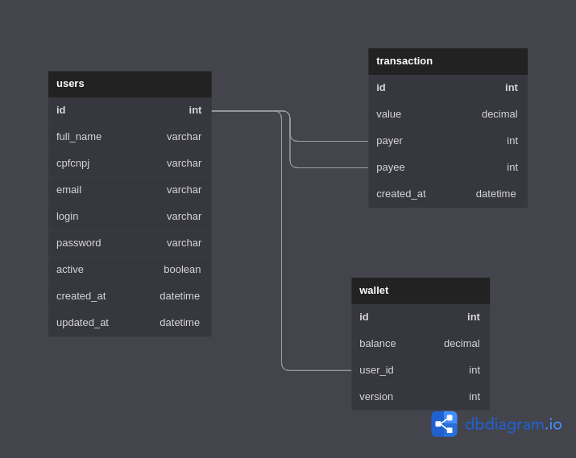
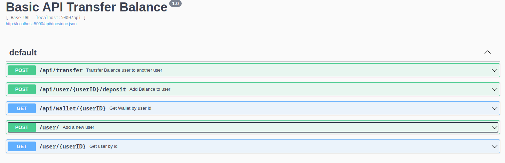

# Challenge Q2Pay

## Architecture




## Docs


Docs: http://localhost:5000/api/docs/index.html#/

# Golang Api

## Requirements
- Docker
- Golang

## Download Collection Postman
docs/quero2pay.postman_collection.json

## Start postgresdb And Go-Server
```bash
make services
```

## Run Local server

Go mod Init

```bash
go mod init challenge-q2pay
```

Install Dependencies

```bash
  go mod tidy
```
Export env
```bash
export DB_URL=user=postgres dbname=postgres password=postgres sslmode=disable
export PORT=5000
```

Run Server Service

```bash
 make run
```
